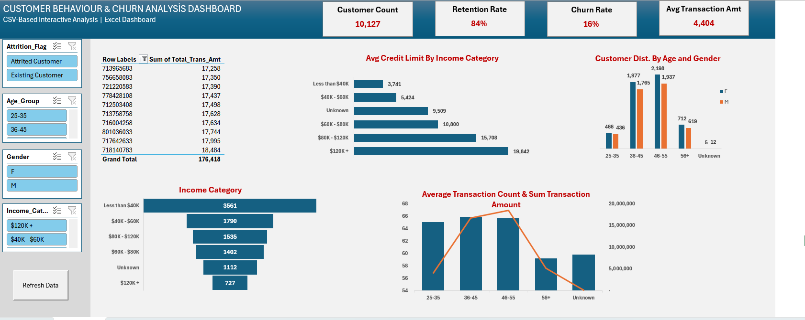
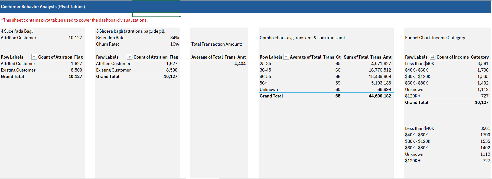
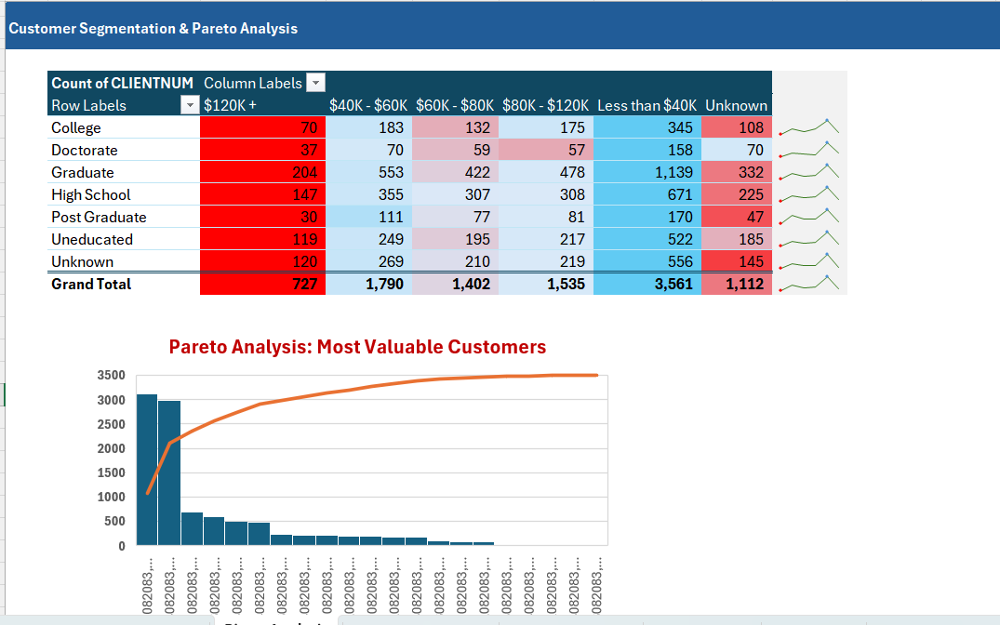
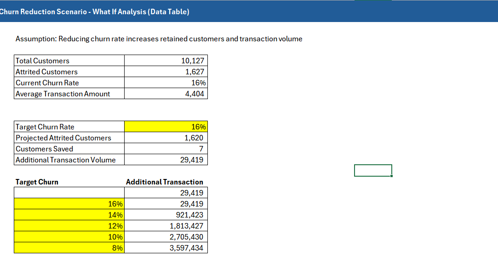

# Credit Card Customer Behavior & Churn Analysis

This project analyzes credit card customer data to understand customer behavior, identify churn patterns, and generate business insights using advanced Excel analytics.

The analysis includes data cleaning, customer segmentation, transaction behavior analysis, scenario modeling, and an interactive dashboard.

---

## Dashboard Preview

---

## Dataset

The dataset contains information about **10,000+ credit card customers**, including:

- Customer demographics (age, gender, education, income)
- Credit card financial information (credit limit, utilization ratio)
- Customer transaction behavior (transaction amount and count)
- Customer activity metrics (inactive months, contact count)
- Customer status (Existing vs Attrited customers)

---

## Data Preparation

Power Query was used to clean and transform the dataset.

Key transformations include:

- Handling missing values
- Creating age groups
- Creating customer tenure categories
- Defining credit utilization levels

---

## Pivot Analysis

Pivot tables were used to analyze customer behavior and segmentation.

Key analyses include:

- Churn vs retention distribution
- Customer income distribution
- Age and gender segmentation
- Transaction behavior analysis

---

## Scenario Analysis

What-if analysis was used to simulate business scenarios such as credit limit increases and churn reduction impact.

---

## Key Insights

- Total Customers: **10,127**
- Churn Rate: **16%**
- Retention Rate: **84%**

Additional findings:

- Higher income groups tend to have significantly higher credit limits.
- The largest customer segment falls within the **36–55 age range**.
- A small portion of customers generates a large share of total transaction volume, supporting the **Pareto principle**.

---

## Tools Used

- Microsoft Excel  
- Power Query  
- Pivot Tables & Pivot Charts  
- What-If Analysis  
- Conditional Formatting  
- VBA Macro (Refresh Data)

---

## Project Goal

The goal of this project is to demonstrate how Excel can be used to perform end-to-end business analytics, from data preparation to interactive dashboard reporting and scenario analysis.
