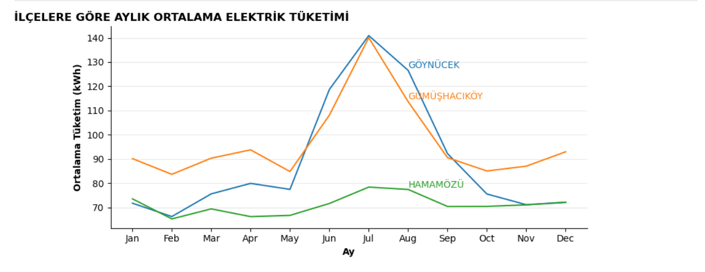
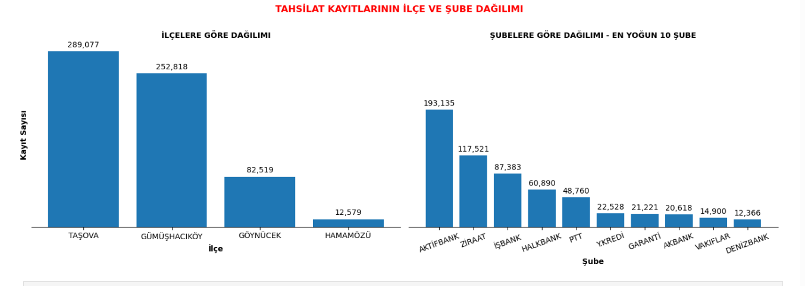
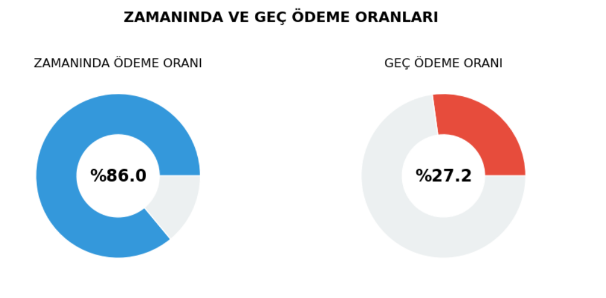

# Energy Retail Data Analysis – Case Study

This project analyzes electricity consumption and payment data from three districts in Amasya, Turkey.
The goal is to explore customer behavior, identify consumption patterns, and evaluate collection performance using Python-based data analysis.

---

# Project Overview

The dataset contains electricity consumption for the following districts:

* Hamamözü
* Gümüşhacıköy
* Göynücek

The analysis focuses on:

* electricity consumption patterns
* customer segmentation
* district-level differences
* payment delay risk

---

# Analysis Workflow

## 1. Data Exploration

* Data loading and inspection
* Descriptive statistics
* Missing value analysis
* Outlier detection
* Dataset structure understanding

---

# Key Visualizations

## Monthly Electricity Consumption by District

This visualization shows the seasonal electricity consumption trends across districts.

Consumption increases significantly during summer months, especially in **July and August**, indicating strong seasonal demand.

---

## Collection Records Distribution by District and Bank Branch

This chart illustrates how payment transactions are distributed across districts and bank branches.

Certain bank branches handle a significantly higher number of payment transactions, indicating preferred payment channels.

---

## On-Time vs Late Payment Ratio

The following visualization shows the ratio of customers paying on time versus those paying late.

Approximately **86% of payments are made on time**, while **around 27% include delayed payments**, highlighting potential areas for improving collection monitoring.

---

# Data Storytelling

The final stage of the analysis focuses on interpreting the results and generating business insights.

Key analyses include:

* District-level consumption comparison
* Customer segmentation based on consumption levels
* Payment delay risk analysis by district and customer type
* Data-driven recommendations for improving collection processes

---

# Key Insights

* Electricity consumption differences between districts are largely driven by **customer composition rather than seasonal effects**.
* **Commercial customers** generally show higher electricity consumption levels.
* **Payment delay risk varies across districts**, indicating regional behavioral differences.
* Certain customer groups such as **municipal or infrastructure-related accounts** show higher delay ratios.

---

# Technologies Used

* Python
* Pandas
* NumPy
* Matplotlib
* Seaborn
* Jupyter Notebook

---

# Business Value

This analysis provides actionable insights for energy retail companies:

* identifying high-risk customer segments
* improving collection strategies
* understanding regional consumption behavior
* supporting data-driven operational decisions

