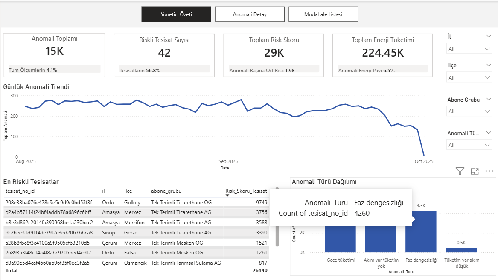
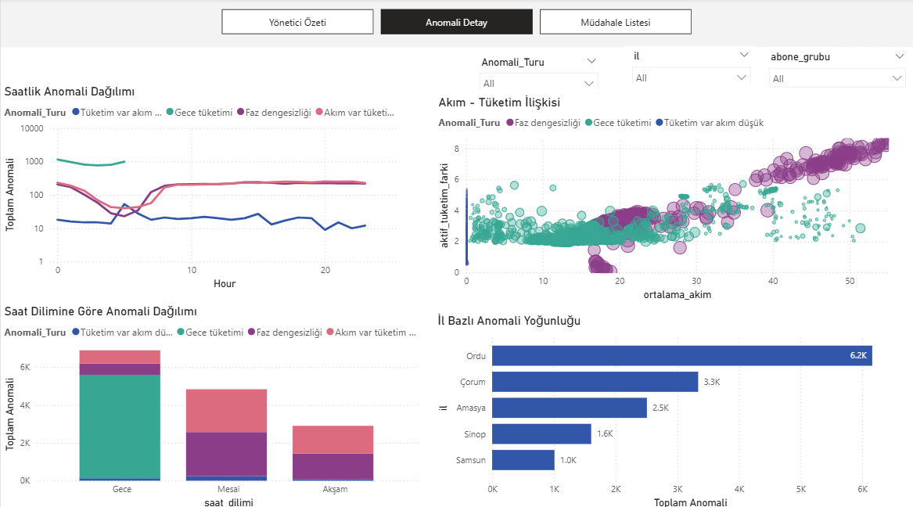
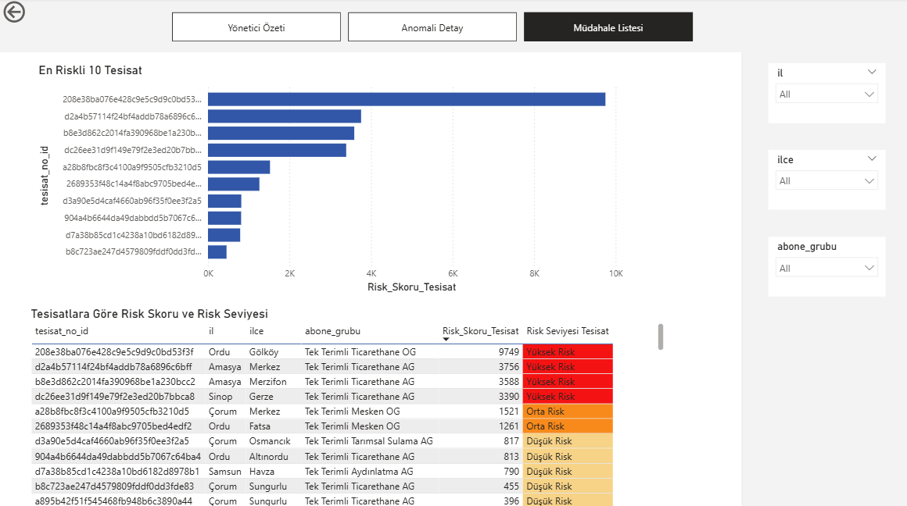

# Electricity Consumption Anomaly Detection Dashboard

This project analyzes electricity consumption data to detect abnormal usage patterns using Power BI.

The goal is to identify inconsistencies between energy consumption, current, and voltage values and generate operational insights for electricity distribution networks.

---

# Project Objective

Electricity distribution companies collect large volumes of smart meter data.  
However, abnormal consumption patterns can indicate:

- Energy theft
- Meter malfunction
- Equipment imbalance
- Network issues

This dashboard detects anomalies and highlights high-risk installations requiring inspection.

---

# Dataset

The dataset contains smart meter measurements including:

- Current (L1, L2, L3)
- Voltage (V1, V2, V3)
- Active energy consumption
- Reactive energy values
- Location data (city, district)
- Subscriber group
- Timestamp

Measurements are recorded at **15-minute intervals**.

---

# Feature Engineering

The following analytical metrics were created:

Average Current  
(L1 + L2 + L3) / 3

Average Voltage  
(V1 + V2 + V3) / 3

Phase Imbalance  
max(L1, L2, L3) − min(L1, L2, L3)

Active Consumption Difference  
Current consumption − previous interval consumption

Time Period Classification  
Night / Working Hours / Evening

---

# Detected Anomaly Types

The dashboard identifies several anomaly patterns:

**Current present but no consumption**  
Possible illegal electricity usage or measurement issue

**Consumption present but current low**  
Possible meter malfunction

**Phase imbalance with high current**  
Potential equipment imbalance

**Night-time consumption anomaly**  
Unexpected usage during night hours

---

# Dashboard Pages

## Executive Overview

High level KPIs and anomaly distribution.

Key metrics include:

- Total anomaly count
- Number of risky installations
- Total risk score
- Total energy consumption

---

## Anomaly Analysis

Explores anomaly patterns across time and electrical measurements.

Includes:

- Hourly anomaly distribution
- Current vs consumption analysis
- Phase imbalance patterns
- Regional anomaly concentration

---

## Intervention List

Identifies installations requiring operational inspection.

Shows:

- Top risk installations
- Risk classification
- Location and subscriber details

---

# Tools Used

- Power BI
- Power Query
- DAX
- Data Visualization

---

# Key Insights

- Most anomalies occur during **night hours**
- **Phase imbalance anomalies** increase during working hours
- Certain locations show higher anomaly density
- High-risk installations can be prioritized for field inspection

---

# Repository Structure

